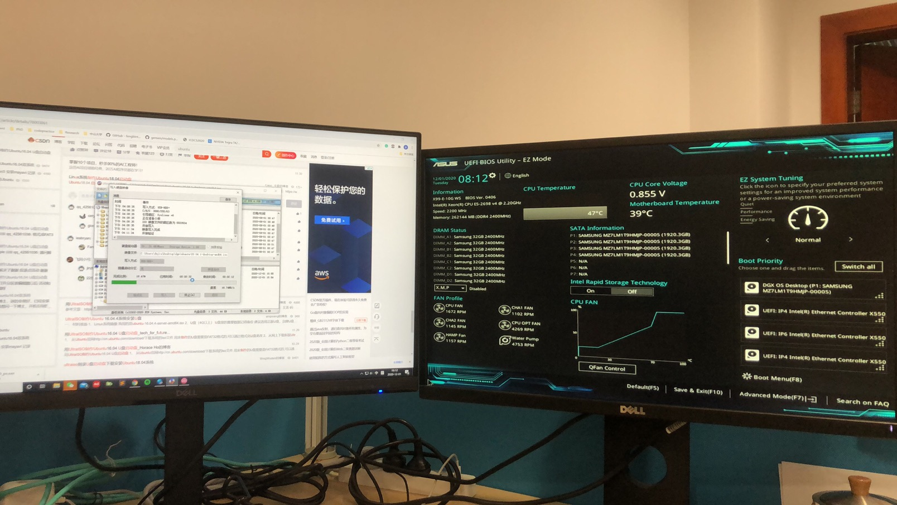

Image DGX with Ubuntu 18.04
==========================

本来DGX装的是Nvidia定制的Ubuntu系统，但是其中的用户太多，系统过乱，于是决定重装系统。

<!--more-->

可惜定制版系统必须买过产品才能申请，dgx的材料也不知道去哪儿找。



在CentOS与Ubuntu之间摇摆过后，还是选择了Ubuntu。

现在有鼠标光标不显示的问题（反正也不用桌面，似乎也不影响。


DGX作为服务器节点，安装系统与台式机略有不同，首先：

df: 列出所有的挂载点。这里真正帮我理解了linux的存储分区模式，是将磁盘分区挂到某个文件夹下的方式。

fdisk -l : 列出所有接入系统的存储设备。注意，没有挂载的的磁盘分区用df是看不到的。

mount：将磁盘分区挂载到某个文件夹。

mdadm：命令用于组合RAID，使得多块物理盘可以以一定的逻辑统一成同一存储空间。

***You should not mount it directly using `mount`. You need first to run mdadm to assemble the raid array. A command like this should do it:***

### Prepare

**Find activate arrays in the `/proc/mdstate`:**

```bash
$ cat /proc/mdstate

Output
Personalities : [raid0] [linear] [multipath] [raid1] [raid6] [raid5] [raid4] [raid10] 
md0 : active raid0 sdc[1] sdd[0]
      209584128 blocks super 1.2 512k chunks

            unused devices: <none>
```

**Unmount the array from the filesystem (if has):**


``` bash
$ sudo unmount /dev/md0
```

**stop and remove the array:**

```bash
$ sudo mdadm --stop /dev/md0
$ sudo mdadm --remove /dev/md0
```

**sdb, sdc, sdd are free disks in my dgx, zero their superblock to reset them to normal:**

```bash
$ sudo mdadm --zero-superblock /dev/sdb
$ sudo mdadm --zero-superblock /dev/sdc
$ sudo mdadm --zero-superblock /dev/sdd
```

**Remove any of the persistent references to the array. Edit the `/etc/fstab` file and comment out or remove the reference to your array:**

```bash
$ sudo vim /etc/fstab

. . .
# /dev/md0 /mnt/md0 ext4 defaults,nofail,discard 0 0
```

**Comment out or remove the array definition from the `/etc/mdadm/mdadm.conf` file:**

```bash
$ sudo vim /etc/mdadm/mdadm.conf

. . .
# ARRAY /dev/md0 metadata=1.2 name=mdadmwrite:0 UUID=7261fb9c:976d0d97:30bc63ce:85e76e91
```

**update the `initramfs` again:**

```bash
$ sudo update-initramfs -u
```


### Now, Create a new array formally

To get started, find the identifiers for the raw disks that you will be using:

```bash
lsblk -o NAME,SIZE,FSTYPE,TYPE,MOUNTPOINT
```

**Use mdadm --create command:**

```bash
# create a raid with three disks
# Here is the RAID0 (level=0), 也就是不互为备份，只不过加速访问。
$ sudo mdadm --create --verbose /dev/md0 --level=0 --raid-devices=3 /dev/sdb /dev/sdc /dev/sdd
# Here is the RAID1 (level=1), 每一个硬盘存一样的东西。
$ sudo mdadm --create --verbose /dev/md0 --level=1 --raid-devices=3 /dev/sdb /dev/sdc /dev/sdd
# Here is the RAID5,略微兼顾性能和存储空间，至少三块硬盘。
sudo mdadm --create --verbose /dev/md0 --level=5 --raid-devices=3 /dev/sdb /dev/sdc /dev/sdd
```

You can ensure that the RAID was successfully created by checking the `/proc/mdstat` file:

```bash
$ cat /proc/mdstat
```


### Create and Mount the Filesystem

Next, create a filesystem on the array:

```bash
# 格式化
$ sudo mkfs.ext4 -F /dev/md0
# 建一个文件夹
$ sudo mkdir -p /mnt/md0
# 把刚刚的raidmount到文件夹
$ sudo mount /dev/md0 /mnt/md0
# Check whether the new space is available
$ df -h -x devtmpfs -x tmpfs
```


后面要开启各种驱动各种库的安装了。

#### Reference

https://www.digitalocean.com/community/tutorials/how-to-create-raid-arrays-with-mdadm-on-ubuntu-16-04