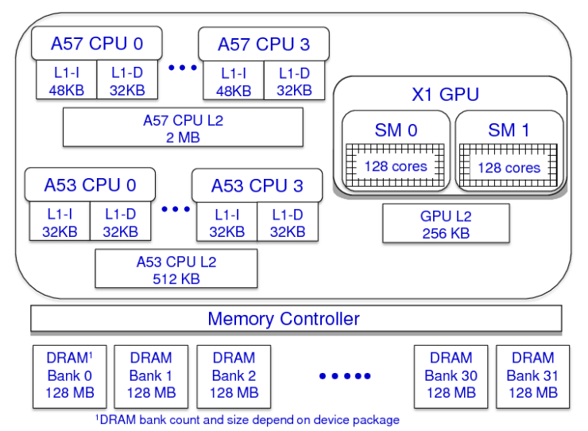

手里有一些Jetson nano和Jetson TX2，最近做了一些非常浅显的性能测试，后找到一篇RTAS的论文获取一些洞见。

<!--more-->

文章是基于自动驾驶系统，safety-critical real-time systems。

Safety-critical embedded systems are undergoing an evolution towards greater autonomy. This evolution is perhaps best exemplified by current trends in the automotive industry. 

DRAM organization: 集成的GPU与CPU是共享内存的。 Integrated GPUs v.s. Discrete GPUs.

作为integrated GPU，有一个特性叫做`zero-copy memory`:  可以让GPU直接使用host的主存，且无需移动数据，原理就是只传递指针。与unified memory不同，unified memory还是会进行拷贝，只不过在用户看来，GPU显存和内存被统一了。

With zero-copy memory, the CPU and the GPU can access the same memory area, avoiding GPU memory allocations and data copies between CPU and GPU memory.

GPU Scheduling:

Whether GPU co-scheduling should be allowed, i.e., whether different tasks should be able to access the GPU concurrently. 让不同的任务可以同时调用GPU。这一点对于自动驾驶系统非常有意义。此外，30帧的识别速度对于自动驾驶系统还是不够用，尤其是在某些紧急情况下。

正常情况下，只有一个stream，所有的计算（kernel）在FIFO order which determined by the GPU

 scheduling。而如果开启了co-scheduling，多个streams就可以同时执行（但一般并不会有什么性能提升）。

Previous work：GPU co-scheduling must be avoided because concurrently executing kernels might adversely interfere with each other.

#### Insights:

其实语音系统，也可以说作为自动驾驶的辅助而不借助云端。

调研：

**Google Assistant** is moving from cloud to local.

Siri等是什么样的解决方案。

#### Reference

An Evaluation of the NVIDIA TX1 for Supporting Real-time Computer-Vision Workloads. - RTAS(CCF-B)